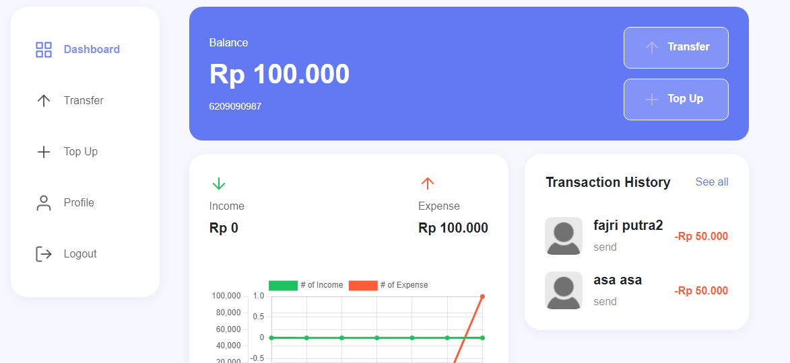
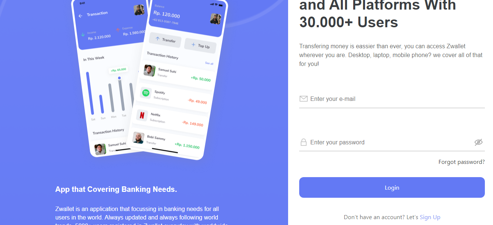
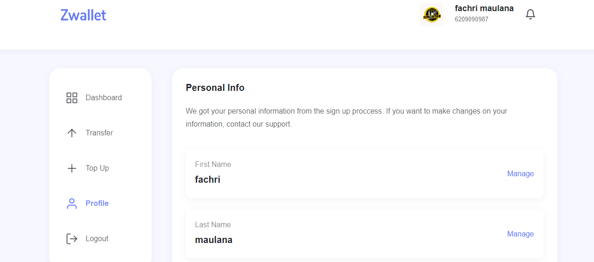

<div align="center">
  <h1> Zwallet </h1>
  <div>
    <a href="https://zwallet-pay.netlify.app"> zwallet </a>
  </div>
  </div>
  
  ## 
  
  ## Getting Started

zwallet is an online payment medium, equipped with many other cool and interesting features, making it easy to transfer and top up money

## Installation

If you want to use zwallet you have to use nodejs version [12+](https://nodejs.org/dist/v16.13.1/node-v16.13.1-x64.msi)

Install the dependencies and devDependencies and start the server.

```sh
git clone this repository
cd repository
npm install
npm run dev
```

## Build With

- [NodeJs] - Runtime Javascript environment for the backend
- [NextJs] - UI Library for the frontend
- [Redux] - Library State Management
- [Redux-Persist] - for handle redux state management
- [Vercel] - Hosting for production

## Demo

<div >
    
   
    
   
</div>
